<p align="center">
  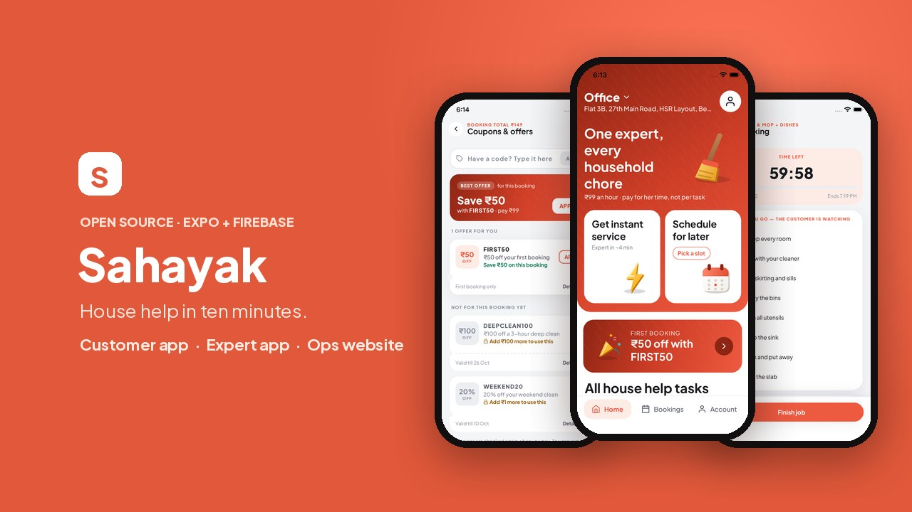
</p>

<h1 align="center">Sahayak</h1>

<p align="center">
  <b>House help in ten minutes.</b> Verified experts for sweeping, mopping, dishes and kitchen work — booked by the hour, paid online, tracked live.
</p>

<p align="center">
  
  
  
  
  
</p>

<p align="center">
  <a href="#-see-it-work">Demo</a> ·
  <a href="#-screens">Screens</a> ·
  <a href="#-run-it-on-your-computer">Run it</a> ·
  <a href="#-how-money-moves">Money</a> ·
  <a href="#-go-live">Go live</a> ·
  <a href="#-project-layout">Layout</a>
</p>

---

## What it is

Three products that share one backend, so a booking made on one phone shows up everywhere at once:

| | Who uses it | What they do |
|---|---|---|
| 🏠 **Customer app** | People who need help at home | Sign in with phone + OTP, save addresses, book now or pick a slot, apply a coupon, pay with Razorpay, track the expert on a map, add time, rate, refer friends |
| 🧹 **Expert app** | House-help experts | Sign up with Aadhaar + selfie, go online, accept job offers, ride to the door, start with a 4-digit code, tick tasks on a timer, withdraw earnings |
| 🖥️ **Ops website** | The Sahayak team | Watch the day live, approve experts, draw service areas, run coupons and referrals, handle refunds and payouts |

The customer and expert apps live in one Expo project (the launcher lets you pick). The ops website is a separate
Vite app in `admin-web/`. Prices, dispatch, payment checks and refunds all run on the server
(Cloud Functions), so the phone can never decide who gets a job or how much is charged.

---

## 🎬 See it work

<table>
  <tr>
    <th width="50%">Customer: book, pay, refer</th>
    <th width="50%">Expert: offer → door → working</th>
  </tr>
  <tr>
    <td>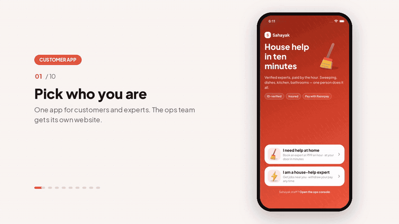</td>
    <td>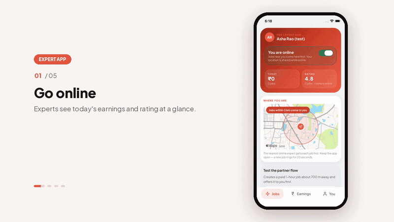</td>
  </tr>
</table>

▶️ **Full walkthrough video (70 s, customer + expert + ops website):** [`docs/video/sahayak-demo.mp4`](docs/video/sahayak-demo.mp4)

---

## 📱 Screens

### Customer app

<table>
  <tr>
    <td align="center">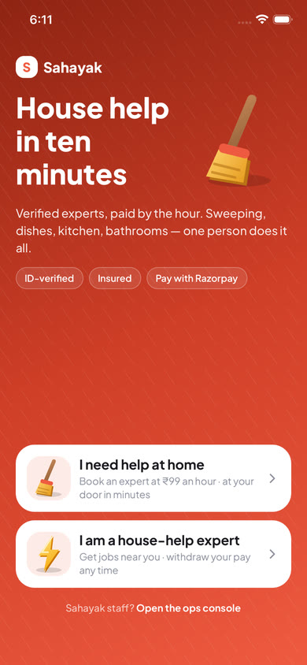<br><sub><b>Pick who you are</b></sub></td>
    <td align="center">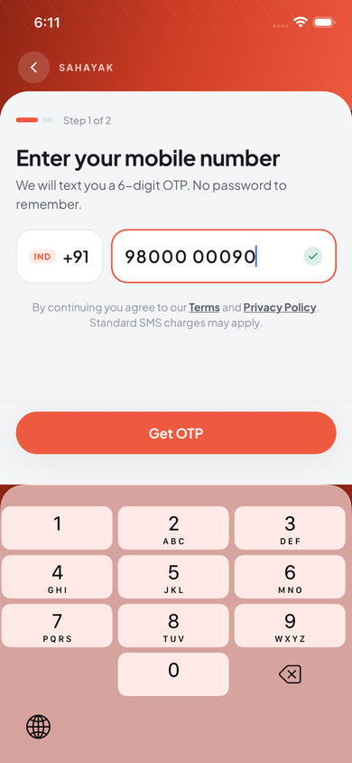<br><sub><b>Phone + OTP sign-in</b></sub></td>
    <td align="center">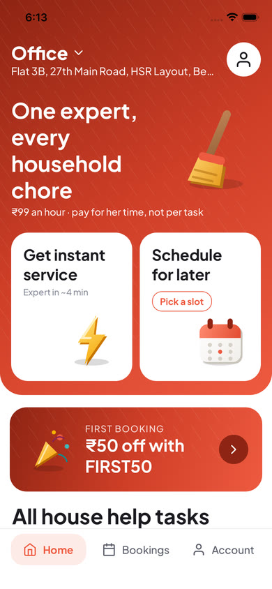<br><sub><b>Home</b></sub></td>
    <td align="center">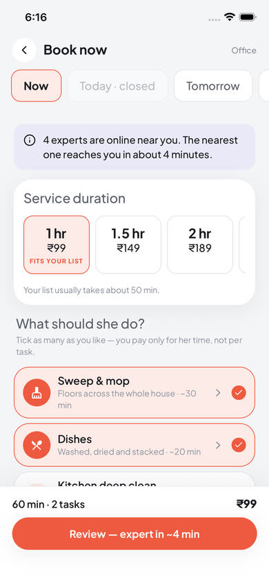<br><sub><b>Book now · ₹99 an hour</b></sub></td>
  </tr>
  <tr>
    <td align="center">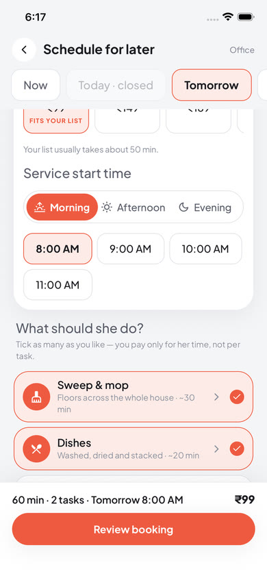<br><sub><b>Slots only when an expert is free</b></sub></td>
    <td align="center">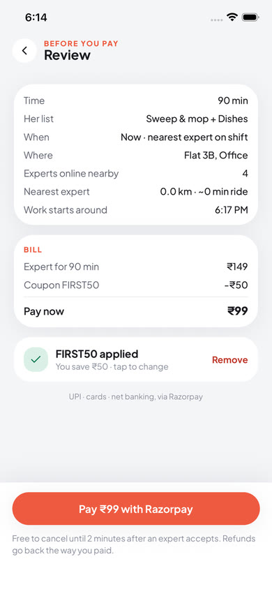<br><sub><b>Review the bill</b></sub></td>
    <td align="center"><br><sub><b>Coupons & offers</b></sub></td>
    <td align="center">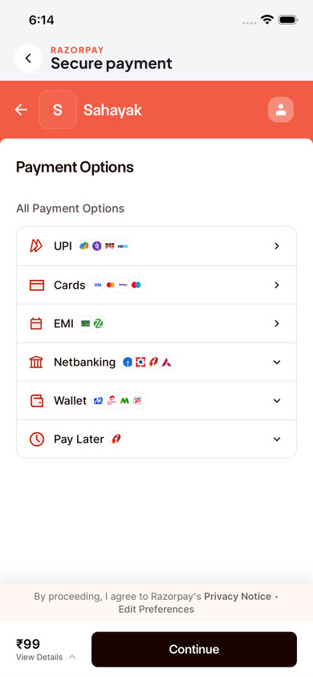<br><sub><b>Razorpay checkout (test)</b></sub></td>
  </tr>
  <tr>
    <td align="center">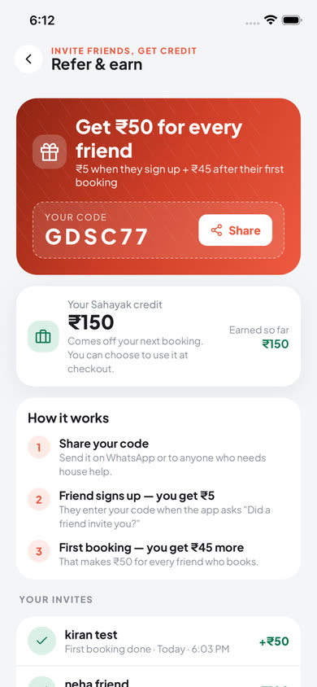<br><sub><b>Refer & earn</b></sub></td>
    <td align="center">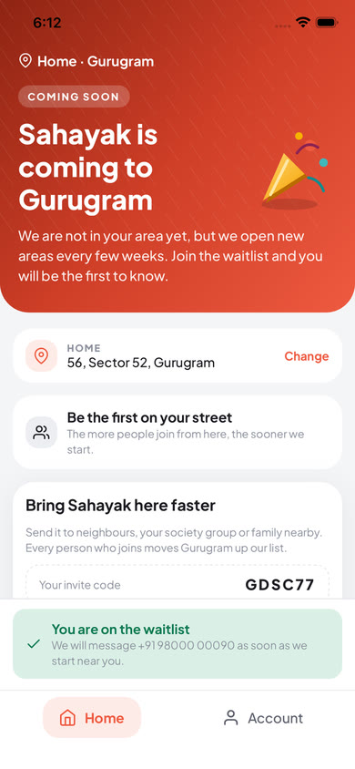<br><sub><b>Coming soon + waitlist</b></sub></td>
    <td align="center">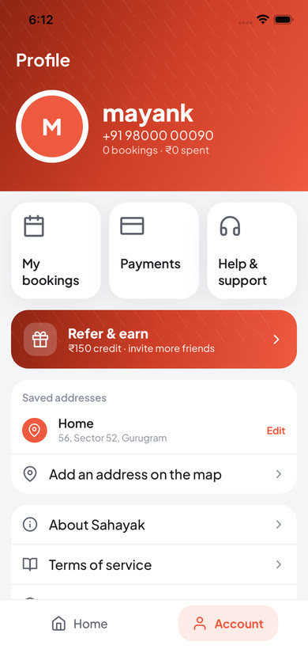<br><sub><b>Account</b></sub></td>
    <td></td>
  </tr>
</table>

### Expert app

<table>
  <tr>
    <td align="center">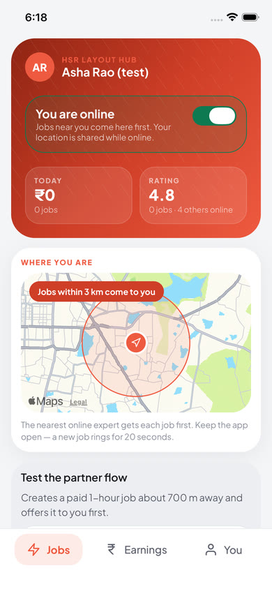<br><sub><b>Go online</b></sub></td>
    <td align="center">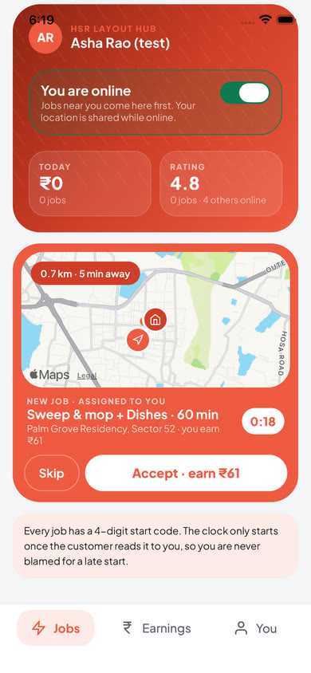<br><sub><b>Job offer</b></sub></td>
    <td align="center">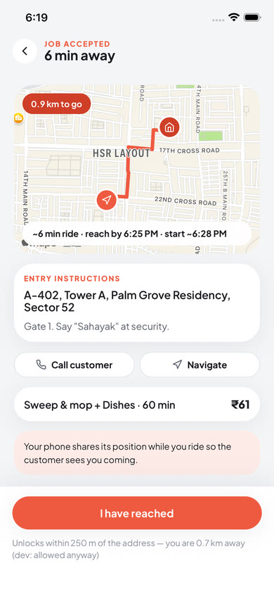<br><sub><b>Ride to the door</b></sub></td>
    <td align="center">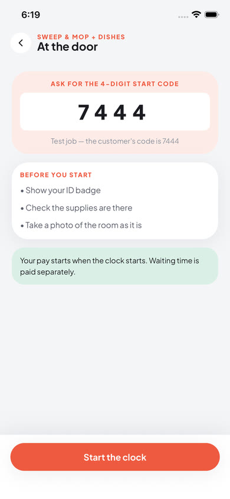<br><sub><b>Start code</b></sub></td>
    <td align="center">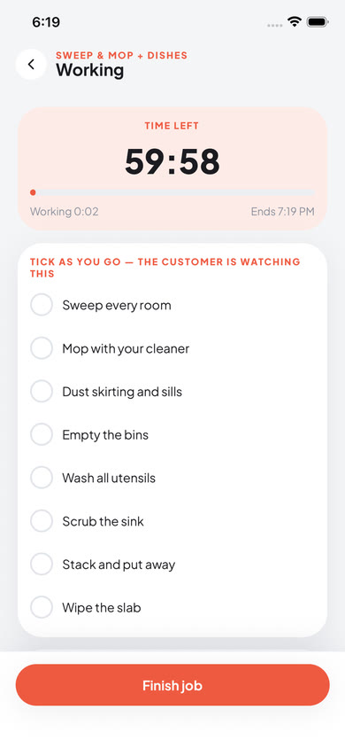<br><sub><b>Working, on the clock</b></sub></td>
  </tr>
</table>

### Ops website

<table>
  <tr>
    <td>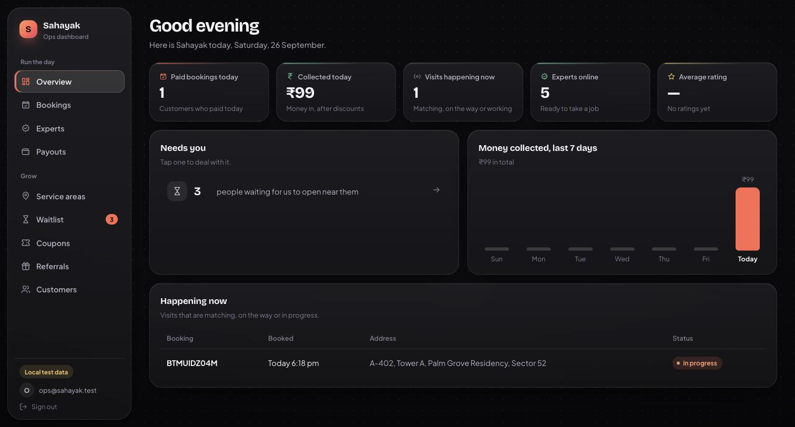<br><sub><b>Overview</b> — today's bookings, money in, who is online</sub></td>
    <td>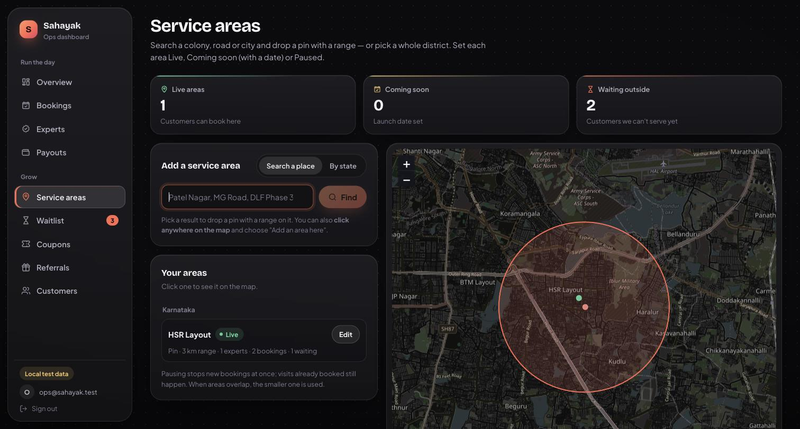<br><sub><b>Service areas</b> — pin + range, Live / Coming soon / Paused</sub></td>
  </tr>
  <tr>
    <td>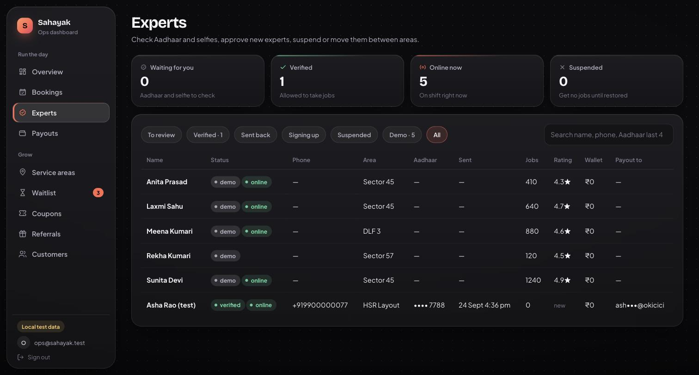<br><sub><b>Experts</b> — Aadhaar and selfie review, approve, suspend</sub></td>
    <td>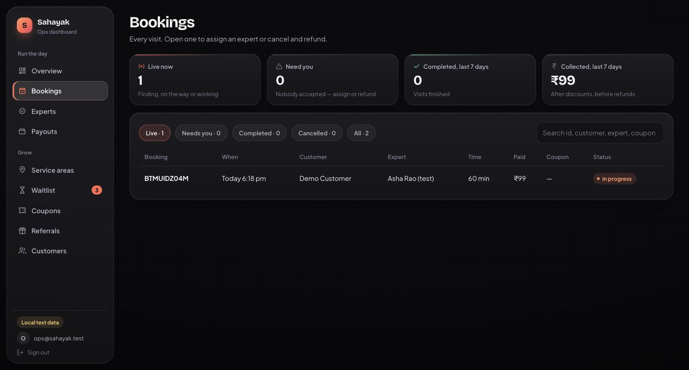<br><sub><b>Bookings</b> — assign an expert, cancel and refund</sub></td>
  </tr>
  <tr>
    <td>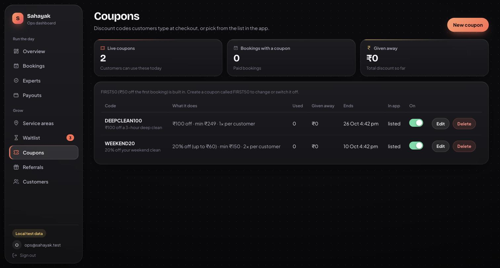<br><sub><b>Coupons</b> — flat or %, limits, dates</sub></td>
    <td>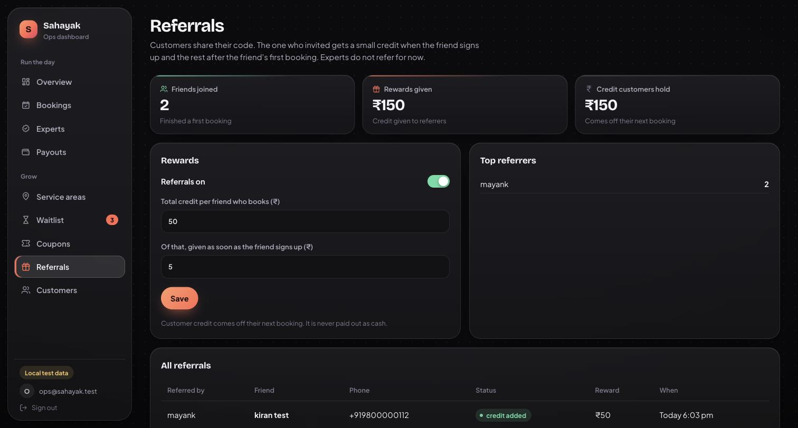<br><sub><b>Referrals</b> — set rewards, see every invite</sub></td>
  </tr>
</table>

---

## ✨ Features

**Booking**
- Book now (nearest free expert, about 10 minutes away) or schedule for today / tomorrow.
- Time slots appear only when a trained expert within 5 km is free at that time — no booking you can't get.
- Pay for time, not per task: **1 h ₹99 · 1.5 h ₹149 · 2 h ₹189 · 3 h ₹279**. Ticked tasks are her checklist, not extra charges.
- Add time during the visit (+15 / +30 / +60 min) from the tracking screen.

**Where we serve**
- Ops draws service areas on a map (a pin with a range, or a real district border).
- Addresses can be saved anywhere, but booking opens only inside a Live area.
- Outside an area, Home turns into a shareable **Coming soon** page with a waitlist and a count of neighbours waiting.

**Offers**
- A proper Coupons page: best offer on top, the ones that don't fit yet with the reason ("Add ₹100 more").
- Coupons are **never applied automatically** — the customer chooses. The server checks every rule again at payment.
- **Refer & earn** (customers only): the friend enters the code after sign-up; the referrer gets **₹5 at once** and **₹45 more** after the friend's first booking. Credit comes off the next booking and is never paid out as cash.

**Experts**
- Sign-up with Aadhaar (checksum-checked, only the last 4 digits stored) and a selfie; ops approves.
- Offers show distance, tasks and pay; a 4-digit start code at the door starts the clock.
- Wallet with UPI / bank payout through RazorpayX, withdraw any time or weekly auto-payout.

**Payments**
- Razorpay checkout; the server verifies the signature and the amount before a booking counts as paid.
- Automatic refunds when no expert is found or the customer cancels in time.

**Notifications**
- Customers hear about every step: booking confirmed, expert on the way, arrived, visit started, done (rate her), cancelled / refunded, no expert free.
- Experts get a loud "New job" alert for every offer, plus scheduled bookings, jobs assigned by ops, cancellations, pay, and the result of their Aadhaar check.
- Ops can send one message to everyone, only customers or only experts from the website (**Notifications** page), with ready-made templates, a lock-screen preview and a history of what was sent.
- Every notice also lands under the 🔔 bell in the app (with an unread count), so nothing is lost when push is off. Tapping one opens the right screen.
- Push goes through Expo's push service to every phone the person signed in on. On the simulator and in Expo Go on Android (no remote push there) the app shows the same banner itself while it is open.

---

## 🚀 Run it on your computer

Everything runs locally on the Firebase emulators — no cloud project, no paid plan, no real SMS.

**You need:** Node 22, Java 17+ (for the emulators), Xcode (iOS simulator) or an Android phone with **Expo Go**.

```bash
git clone <this repo> sahayak && cd sahayak
npm install
npm --prefix functions install
npm --prefix admin-web install

cp .env.example .env                 # set EXPO_PUBLIC_USE_EMULATORS=true
cp functions/.env.example functions/.env   # optional: Razorpay test keys
```

Then, in three terminals:

```bash
npm run firebase:emulators           # 1 · Auth + Firestore + Functions (+ ops website at :5002)
npx expo start --go --clear          # 2 · the app — press i for the iOS simulator, or scan the QR with Expo Go
npm run admin:dev                    # 3 · ops website at http://localhost:5174
```

### Try the whole flow

1. **Ops website** → *Use the test admin* (emulator only) → Service areas → add an area around your test address and set it **Live**.
2. Overview → **Load test data** fills every page with clearly fake sample data. For experts who accept jobs on their own,
   press **Load demo experts** in the app (customer Home when nobody is online, or the in-app ops console): five bots appear
   around your address and ride to the door by themselves.
3. **App** → *I need help at home* → any 10-digit number. The OTP never goes by SMS on the emulator: it is printed in the emulator terminal and listed at
   `http://127.0.0.1:9099/emulator/v1/projects/demo-sahayak/verificationCodes`.
4. Add an address inside the area → **Book now** → Review → pick a coupon → **Pay with Razorpay**.
   In test mode use card `4111 1111 1111 1111` (any future date, any CVV).
5. A demo expert accepts, rides over on the map and you get a start code.

**To try the expert side,** sign in as an expert on a second device or simulator. Sign-up takes 5 steps;
`234123412346` is a valid test Aadhaar number. Approve her on the ops website (Experts), then turn her **online**.

<details>
<summary><b>Testing on your own Android phone</b></summary>

- **Same Wi-Fi (easiest).** Phone and computer on the same Wi-Fi, Expo Go installed. Restart the emulators, allow incoming connections if macOS asks, then scan the QR code. The app finds your computer by itself.
- Office or public Wi-Fi often blocks phone-to-laptop traffic — use your phone's hotspot for the laptop instead.
- Expo Go on Android shows OpenStreetMap maps (its Google map is blank without a native build).
- **Different network:** `npx expo start --go --tunnel`. The tunnel carries only the app, not the emulators, so point the app at a real Firebase project for this.
- The ops website on the phone: `npm run admin:dev:lan`, then open `http://<computer-ip>:5174` (`ipconfig getifaddr en0`).

</details>

<details>
<summary><b>Native builds with EAS</b></summary>

Expo Go runs everything above. A development build adds the native Google map:

```bash
npm install -g eas-cli && eas login && eas init
npm run build:dev:ios        # or build:dev:android
npm run start:dev-client
npm run update               # push JS changes without rebuilding
```

</details>

---

## 💸 How money moves

```
Customer pays
  Review → createOrder   server prices the time, checks the coupon and credit, creates a Razorpay order
         → Razorpay checkout
         → verifyPayment  signature (HMAC) + fetches the payment: right order, right amount, captured
         → booking is paid → dispatch to the nearest free expert
  razorpayWebhook does the same if the app closed before verifying.

Extra time during the visit
  Track → +15 / +30 / +60 min → pay → minutes added, both phones update live.

Expert gets paid
  Visit completed → 62% of the booked and extra time + tips → her wallet (withdrawable after 24 h)
  → UPI or bank via RazorpayX, on demand from ₹100 or weekly auto-payout.
  A rating of 2★ or less holds the earning until ops releases it.

No expert found  → automatic refund
Customer cancels → full refund before assignment, ₹49 fee after
```

Prices live in two files that must match: `PRICE_BY_MIN` in `src/lib/mock.ts` (what the app shows)
and `functions/src/catalog.ts` (what the server charges — the one that counts).

---

## 🌐 Go live

<details>
<summary><b>Firebase</b></summary>

1. Create a Firebase project on the **Blaze** plan (Cloud Functions need it; free at this scale).
2. Add a **Web app** and copy its config into `.env` (`EXPO_PUBLIC_FIREBASE_*`) and `admin-web/.env` (`VITE_FIREBASE_*`).
3. Turn on **Authentication → Phone** (and Email/Password for staff). Add a test number while you build.
4. Create **Firestore** (e.g. `asia-south1`, Mumbai).
5. For Android builds add the SHA-1 / SHA-256 from `eas credentials -p android`, then download `google-services.json` into the project root (it is git-ignored).
6. Deploy: `firebase login` then `npm run firebase:deploy` and `npm run admin:deploy`.
7. **Make yourself an admin:** Authentication → add a user with email + password → Firestore collection `admins` → document id = that user's UID.

</details>

<details>
<summary><b>Push notifications</b></summary>

1. Run `eas init` once — it writes the EAS project id the app needs to get a push address.
2. Build the app with EAS (`npm run build:dev:android` / `build:dev:ios`). Android needs a build for remote push; Expo Go on iPhone works for testing.
3. Android: add your Firebase `google-services.json` and upload its FCM key to Expo (`eas credentials`). iOS: EAS sets up the push key for you.
4. Optional: if you turn on "enhanced push security" in your Expo account, put the access token in `functions/.env` as `EXPO_ACCESS_TOKEN`.

The server sends everything from `functions/src/notify.ts`. No other setup is needed on the emulators.

</details>

<details>
<summary><b>Razorpay</b></summary>

1. Sign up at razorpay.com and stay in **Test mode** → Settings → API Keys → generate a test key.
2. `EXPO_PUBLIC_RAZORPAY_KEY_ID` in `.env` gets the **key id** only.
3. `functions/.env` gets the key id **and the secret** — the secret never leaves the server.
4. Webhook → `https://asia-south1-<project-id>.cloudfunctions.net/razorpayWebhook`, events `payment.captured` and `payment.failed`, secret → `RAZORPAY_WEBHOOK_SECRET`.
5. **RazorpayX** (paying experts): account number → `RAZORPAYX_ACCOUNT_NUMBER`; webhook → `.../razorpayXWebhook` with `payout.processed`, `payout.reversed`, `payout.failed`, secret → `RAZORPAYX_WEBHOOK_SECRET`.
6. `KYC_HASH_SECRET` (`openssl rand -hex 32`) fingerprints Aadhaar numbers so one card can't sign up twice. Set it once, never change it.

On the emulators you can leave all of this empty: payouts are faked and marked paid.

</details>

### Keeping secrets out of git

`.gitignore` already blocks every `.env` file (only the `*.env.example` templates are committed),
`google-services.json`, `GoogleService-Info.plist`, service-account JSON, `*.pem` / `*.key` / `*.p12`,
Razorpay key downloads, emulator data and debug logs. The app only ever holds the **public**
Razorpay key id; the secret stays in `functions/.env` on the server.

---

## 🗂 Project layout

```
src/app/                 screens (expo-router: one file = one route)
  index.tsx              launcher — customer, expert or ops
  login.tsx              phone + OTP, name, referral code
  notifications.tsx      the bell: every notice for customers and experts
  customer/              (tabs) home · bookings · account
                         address · book · review · coupons · matching · track · rate
                         payments · refer · coming-soon
  partner/               (tabs) jobs · earnings · profile
                         verify (sign-up) · offer · job · payout
  admin/                 in-app ops console
src/components/          ui kit, icons, maps (native + OpenStreetMap fallback), Razorpay checkout
src/lib/                 Firebase, auth, live data hooks, typed API calls, prices, service areas
functions/src/           Cloud Functions
  index.ts               orders, payment checks, dispatch, slots, visit lifecycle, refunds
  growth.ts              service areas, waitlist, coupons, referrals, customer credit
  kyc.ts · wallet.ts     expert sign-up and Aadhaar checks · earnings and payouts
  razorpay.ts            orders, refunds, webhooks, RazorpayX
  notify.ts              notifications: inbox, Expo push, booking/offer notices, ops broadcasts
  catalog.ts             prices — the server's copy is the one that counts
admin-web/               ops website (Vite + React + Leaflet) → Firebase Hosting
firestore.rules          who can read and write what
docs/                    README images and demo video
```

## ✅ Checks

```bash
npm run typecheck && npm run lint
npm --prefix functions run typecheck
npm --prefix admin-web run build
```

## Still to do

- Plans / subscriptions, in-app chat and calling are UI only.
- Scheduled jobs (auto-open "coming soon" areas, weekly payouts) don't run on the local emulators.
- The referral share link needs a hosted page that redirects to the store.
